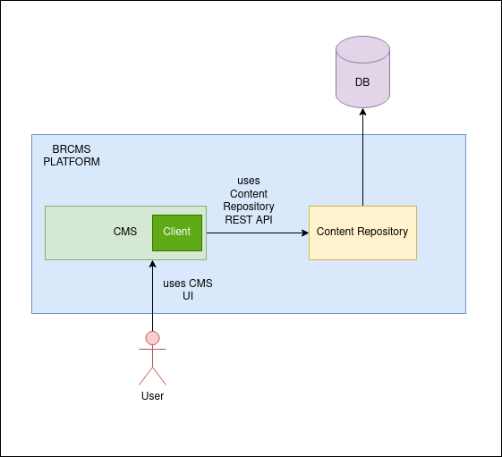

# BRCMS

BRCMS is a sample content-repository and CMS implementation. It's more like a showcase of how to
implement a basic content repository and an example service which uses the content repository.



Project architecture contains 2 stand-alone server. Content repository and Content management system.
Content repository server acts like a node store, and it provides CRUD operations regarding nodes
over REST API. Content management backend also provides REST API but more domain specific. As an example
it uses a test data of products.

Project also uses PostgreSQL database for persisting the nodes. In running section, more detailed
explanation can be found regarding how to run all connected components.

# 1. Project Structure

Project is a maven multimodule project. Maven is used because gradle sometimes too complex for
Github dependabot system. This project is actively scanning by Github's dependabot dependency
checking mechanism. There are 3 submodule of the project.

1. content-repository
2. cms-backend
3. client

Project uses maven for dependency management, docker and docker-compose for container support.
Checkstyle for advanced Java linting and code quality. Code rules are pretty strict, they also
ensure a certain amount of cylomatic complexity.

Project uses spotify code formatting library which uses Google java code format under the hood.
JDK 17 is needed for compiling the project.

For testing it uses mockito for mocking the object and for integration test it uses testcontainer.
which temporarily creates test docker containers for required tasks.

## 1.1. Content-Repository

Content-repository is a very basic Apache Jackrabbit like implementation. It provides some REST
operations for node creation.

```
NODE OPERATIONS
================================================================================
POST   /nodes                        : Creates a parent node
POST   /nodes/{parent-node-id}       : Creates a child node under parent node
GET    /nodes                        : Lists all nodes
GET    /nodes?by-path={path}         : Traverse node by path
GET    /nodes/{id}                   : Gets specific node
DELETE /nodes/{id}                   : Deletes specific node
PUT    /nodes/{id}                   : Updates a node
```

## 1.2. Content management system

Provided content management system server exposes a REST API for product operations.

## 1.3. Client

Client library provides a programmatic way to interact with content repository. Content management
system uses that client library under the hood for interacting with content repository.

# 2. Running Project

BRCMS project needs a postgresql 14 database for persisting the data. Provided `docker-compose.yml`
can easily boot up a database server. Be sure that you have docker and docker-compose installed correctly.

## 2.1. Booting up the database

A standalone database can be used but for local development purposes it's easy to boot up the `docker-compose.yml`
definition. In the project root directory type the following for running the database server:

```shell
docker-compose up -d
```

`-d` option will run in daemon mode. If you want to see all output and shuting down the server via Ctrl-C then ignore the `-d` flag.

## 2.1. Running content repository server

by default content repository is a standalone server which runs on 9090 port. For running this stand-alone server you can use maven spring-boot plug-in.

```shell
./mvnw install -DskipTests && ./mvnw -pl content-repository spring-boot:run
```

or after compilation you can just run the jar file.

```shell
./mvnw clean compile package -DskipTests
cd content-repository/target/
java -jar content-repository.jar
```

It's possible to create a docker image and running it via docker image

```shell
cd content-repository/
docker build -t bloomreach/content-repository:1.0 .
```

Then running and connecting to actively running postgres server:

```shell
docker run --name brcms-content-repository \
    -p 127.0.0.1:9090:8080 \
    -e POSTGRES_URL='jdbc:postgresql://brcms-postgres:5432/brcms' \
    -e POSTGRES_USERNAME='brcms' \
    -e POSTGRES_PASSWORD='brcms' \
    --network brcms \
    -d \
    bloomreach/content-repository:1.0
```

Or you can just run uploaded version from docker hub:

```shell
docker run --name brcms-content-repository \
    -p 127.0.0.1:9090:8080 \
    -e POSTGRES_URL='jdbc:postgresql://brcms-postgres:5432/brcms' \
    -e POSTGRES_USERNAME='brcms' \
    -e POSTGRES_PASSWORD='brcms' \
    --network brcms \
    -d \
    firatkucuk/brcms-content-repository:1.0
```

After runing content repository server you can reach out swagger interface for REST API trials.

[Swagger API Documentation](http://localhost:9090/swagger-ui/index.html)

You can also use curl for interacting with REST API:

### 2.2.1 Creating a parent node

```shell
curl -X POST \
     -H 'Content-Type: application/json' \
     -d '{"name": "my-node", "properties": [{"key": "SomeBoolean", "type": "BOOLEAN", "value": true}]}' \
     http://localhost:9090/nodes
```

For successful operation it returns `201` status code and node id

```
01GBDW0SNSZAX2KNYJ58YXWR1M
```

### 2.2.2 Creating a child node

```shell
curl -X POST \
     -H 'Content-Type: application/json' \
     -d '{"name": "child-node", "properties": [{"key": "SomeBoolean", "type": "BOOLEAN", "value": true}]}' \
     http://localhost:9090/nodes/01GBDW0SNSZAX2KNYJ58YXWR1M
```

For successful operation it returns `201` status code and node id

```
01GBDW1KHG9J62SRJBBYGE7A4M
```

### 2.2.3 Listing all nodes

```shell
curl -X GET \
     -H 'Content-Type: application/json' \
     http://localhost:9090/nodes
```

It returns paginated list of nodes and returns `200` status code for successful result.

```json
{
  "content": [
    {
      "id": "01GBDW1KHG9J62SRJBBYGE7A4M",
      "parentId": "01GBDW0SNSZAX2KNYJ58YXWR1M",
      "name": "child-node",
      "createdAt": "2022-08-26T20:03:42.256648Z"
    },
    {
      "id": "01GBDW0SNSZAX2KNYJ58YXWR1M",
      "parentId": null,
      "name": "my-node",
      "createdAt": "2022-08-26T20:03:15.769934Z"
    }
  ],
  "pageable": {
    "sort": {
      "empty": false,
      "sorted": true,
      "unsorted": false
    },
    "offset": 0,
    "pageNumber": 0,
    "pageSize": 10,
    "paged": true,
    "unpaged": false
  },
  "last": true,
  "totalElements": 2,
  "totalPages": 1,
  "size": 10,
  "number": 0,
  "sort": {
    "empty": false,
    "sorted": true,
    "unsorted": false
  },
  "first": true,
  "numberOfElements": 2,
  "empty": false
}
```

### 2.2.4 Fetching a specific node

```shell
curl -X GET \
     -H 'Content-Type: application/json' \
     http://localhost:9090/nodes/01GBDW0SNSZAX2KNYJ58YXWR1M
```

It returns a single node result for requested id. For successful operation it gives http `200` status code.

```json
{
  "id": "01GBDW0SNSZAX2KNYJ58YXWR1M",
  "name": "my-node",
  "parentId": null,
  "parentName": null,
  "createdAt": "2022-08-26T20:03:15.769934Z",
  "properties": {
    "SomeBoolean": true
  }
}
```

### 2.2.5 Traversing a specific node

This api can returns a detailed node info and child nodes of a specified node by path.

```shell
curl -X GET \
     -H 'Content-Type: application/json' \
     http://localhost:9090/nodes?by-path=/my-node
```

```json
{
  "id": "01GBDW0SNSZAX2KNYJ58YXWR1M",
  "name": "my-node",
  "parentId": null,
  "parentName": null,
  "createdAt": "2022-08-26T20:03:15.769934Z",
  "properties": {
    "SomeBoolean": true
  },
  "children": [
    {
      "id": "01GBDW1KHG9J62SRJBBYGE7A4M",
      "name": "child-node",
      "parentId": "01GBDW0SNSZAX2KNYJ58YXWR1M",
      "parentName": "my-node",
      "createdAt": "2022-08-26T20:03:42.256648Z",
      "properties": {
        "SomeBoolean": true
      }
    }
  ]
}
```

it fetches the node data and first children.

### 2.2.5 Updating a node

```shell
curl -X PUT \
     -H 'Content-Type: application/json' \
     -d '{"name": "my-updated-node"}' \
     http://localhost:9090/nodes/01GBDW0SNSZAX2KNYJ58YXWR1M
```

it returns a `200` success result.

### 2.2.6 Deleting a node

Deleting operation is a cascaded operation, If a parent node is deleted all related children and associated properties
will be deleted.

```shell
curl -X DELETE \
     -H 'Content-Type: application/json' \
     http://localhost:9090/nodes/01GBDW0SNSZAX2KNYJ58YXWR1M
```

it returns a `200` success result.

## 2.2. Running content management system

Content management system is the API facade of all brcms system. By default it's running on 8080 port.

you can run directly using spring-boot maven plug-in.

```shell
./mvnw install -DskipTests && ./mvnw -pl cms-backend spring-boot:run
```

or after compilation you can just run the jar file.

```shell
./mvnw clean compile package -DskipTests
cd cms-backend/target/
java -jar cms-backend.jar
```

It's possible to create a docker image and running it via docker image

```shell
cd cms-backend/
docker build -t bloomreach/cms-backend:1.0 .
```

Then running and connecting to actively running postgres server:

```shell
docker run --name brcms-cms-backend \
    -p 127.0.0.1:8080:8080 \
    -e CONTENT_REPOSITORY_HOST='http://brcms-content-repository:8080' \
    -e CMS_LOAD_TEST_DATA='true' \
    --network brcms \
    -d \
    bloomreach/cms-backend:1.0
```

Or you can just run uploaded version from docker hub:

```shell
docker run --name brcms-cms-backend \
    -p 127.0.0.1:9090:8080 \
    -e POSTGRES_URL='jdbc:postgresql://brcms-postgres:5432/brcms' \
    -e POSTGRES_USERNAME='brcms' \
    -e POSTGRES_PASSWORD='brcms' \
    --network brcms \
    -d \
    firatkucuk/brcms-cms-backend:1.0
```
